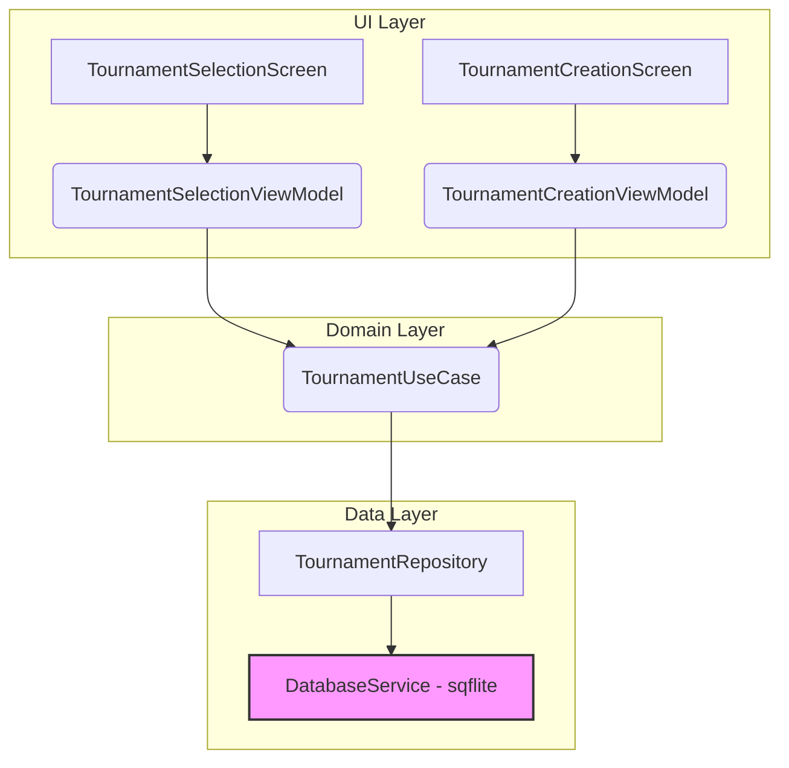
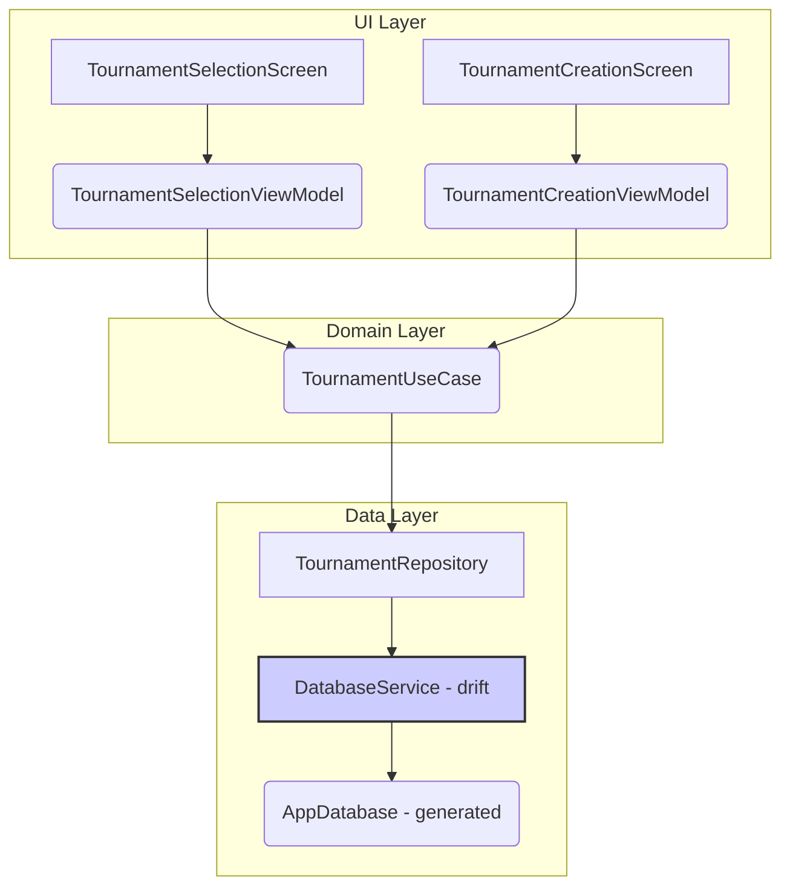

# Modification Design: Unit Testing and Refactoring

## 1. Overview

The goal of this modification is to improve the quality, maintainability, and performance of the Chessmate application. This will be achieved by:

1.  **Introducing a comprehensive suite of unit and widget tests.** The project currently has no tests, which makes it difficult to verify functionality and refactor with confidence.
2.  **Refactoring the data persistence layer.** The application currently uses `sqflite` with manual SQL queries, despite having the more powerful and type-safe `drift` package as a dependency. Migrating to `drift` will reduce boilerplate, improve type safety, and make the database logic more robust.

## 2. Detailed Analysis

The `codebase_investigator` tool and a manual review have revealed the following about the current architecture:

*   **Architecture:** The application follows a Clean Architecture pattern, separating concerns into `data`, `domain`, and `ui` layers. This is a strong foundation.
*   **Design Pattern:** It uses a variant of the Model-View-ViewModel (MVVM) pattern. ViewModels in the `ui` layer orchestrate calls to a central `TournamentUseCase`.
*   **State Management:** State is centralized in `TournamentUseCase`, which is a `ChangeNotifier`. This singleton holds the list of tournaments and notifies listeners of changes. Widgets likely use the `watch_it` package to subscribe to these changes.
*   **Dependency Injection:** `get_it` is used as a service locator to provide singleton instances of services, repositories, and use cases. This is a simple and effective DI strategy for this app's scale.
*   **Navigation:** `go_router` manages navigation, which is a modern and recommended approach.
*   **Data Persistence:** This is the primary area for improvement. `DatabaseService` uses the `sqflite_common_ffi` package directly, with handwritten `Map<String, dynamic>` conversions and raw SQL strings. This is error-prone and verbose. The `drift` package is already included in `pubspec.yaml` but is not being used.

### Problem Statement

1.  **Lack of Tests:** Without tests, there is no safety net to prevent regressions when adding new features or refactoring. It also makes it difficult to verify that the existing business logic is correct.
2.  **Manual Database Code:** The manual `sqflite` implementation is a significant source of potential bugs and maintenance overhead. There is no compile-time checking for SQL syntax or for the mapping between database rows and Dart objects.

## 3. Alternatives Considered

### 3.1. Data Persistence

*   **Alternative 1: Keep `sqflite` and improve it.** We could add a layer of abstraction on top of the raw SQL queries to make them more reusable.
    *   **Pros:** Less disruptive in the short term.
    *   **Cons:** Does not solve the fundamental issues of type-safety and boilerplate. We would be reinventing features that `drift` already provides.
*   **Alternative 2: Migrate to `drift`.** This involves defining tables in Dart, and `drift` will generate the necessary code for type-safe queries and data classes.
    *   **Pros:** Massive improvement in developer experience, compile-time safety, reduced boilerplate, and better performance through batched operations and optimized queries. `drift` is already a dependency.
    *   **Cons:** Requires a one-time effort to rewrite the database layer.

**Decision:** Migrating to `drift` is the clear winner. It aligns with modern Flutter development practices and directly addresses the main weakness in the current architecture.

### 3.2. State Management

*   **Alternative 1: Keep the `ChangeNotifier`-based approach.** The current `TournamentUseCase` acts as a single, global state store.
    *   **Pros:** Simple to understand and already implemented. Sufficient for the current scope of the app.
    *   **Cons:** Can become difficult to manage as the app grows. A single `ChangeNotifier` for all tournament state might lead to unnecessary widget rebuilds.
*   **Alternative 2: Refactor to a more granular state management solution (e.g., Riverpod, BLoC).**
    *   **Pros:** Better scalability and performance optimization.
    *   **Cons:** A significant refactoring effort that is not the primary goal of this modification.

**Decision:** We will keep the existing `ChangeNotifier` approach. The primary focus is on testing and the data layer. The state management can be revisited in a future refactoring effort if the app's complexity increases significantly.

## 4. Detailed Design

The modification will be split into two main phases: Testing and Refactoring.

### Phase 1: Testing

We will add tests from the bottom up (from the data layer to the UI layer).

1.  **Unit Test `TournamentUseCase`:**
    *   Mock the `TournamentRepository` dependency.
    *   Write tests for each method (`loadInitialData`, `createTournament`, `deleteTournament`).
    *   Verify that the internal state (`tournaments`) is updated correctly.
    *   Verify that `notifyListeners()` is called when the state changes, as confirmed by the web research.

2.  **Unit Test `TournamentRepositoryImpl`:**
    *   Mock the `DatabaseService` dependency.
    *   Write tests to ensure the repository correctly calls the database service and handles data conversion.

3.  **Widget Test UI Screens:**
    *   Write widget tests for `TournamentSelectionScreen` and `TournamentCreationScreen`.
    *   Mock the `TournamentCreationViewModel` and `TournamentSelectionViewModel`.
    *   Verify that the UI displays the correct data from the view models.
    *   Test user interactions (e.g., tapping buttons, filling forms) and verify that the correct methods are called on the view models.

### Phase 2: Refactoring the Data Layer to use Drift

This phase will replace the manual `sqflite` implementation.

1.  **Create a Drift Database Definition:**
    *   Create a new file `lib/data/services/drift_database.dart`.
    *   Define a `Tournaments` table class that mirrors the `Tournament` model.
    *   Define an `AppDatabase` class that uses the `Tournaments` table.

2.  **Run Build Runner:**
    *   Run `dart run build_runner build --delete-conflicting-outputs` to generate the `*.g.dart` file for the database.

3.  **Replace `DatabaseService`:**
    *   Delete the contents of `lib/data/services/database_service.dart`.
    *   Replace it with a new implementation that uses the generated `AppDatabase` from `drift`. The new service will wrap the `AppDatabase` and implement the same interface as the old service.

4.  **Update Dependency Injection:**
    *   In `lib/utils/locator.dart`, update the `setupLocator` function to initialize and register the new `AppDatabase` and the refactored database service.

### Architectural Diagrams (Mermaid)

#### Current Architecture

#### Proposed Architecture with Drift

## 5. Summary of Design

This design prioritizes stability and maintainability. By first adding a comprehensive test suite, we can refactor the data layer with confidence. The migration to `drift` will eliminate a significant source of potential bugs and make future development easier and faster. The core business logic and UI structure will remain largely unchanged, minimizing the risk of introducing new issues.

## 6. References

*   [Testing `ChangeNotifier` subclasses](https://flutter.dev/docs/cookbook/testing/unit/mocking)
*   [Drift Documentation](https://drift.simonbinder.eu/)
*   [Migrating from `sqflite` to `drift`](https://drift.simonbinder.eu/docs/getting-started/existing_app/)
